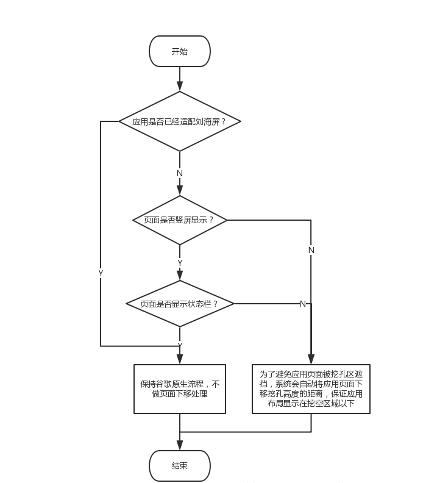
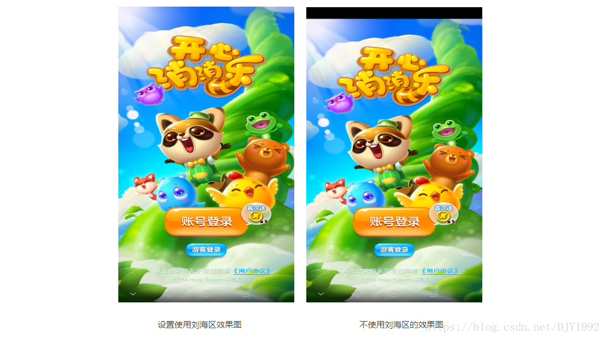
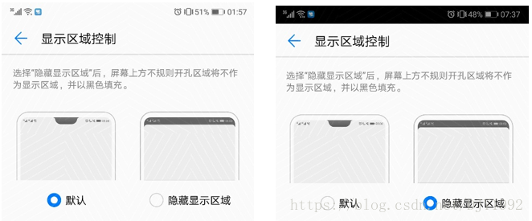
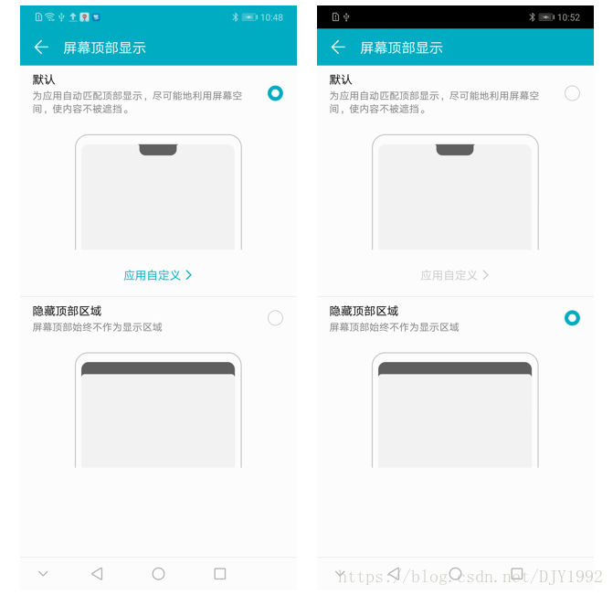
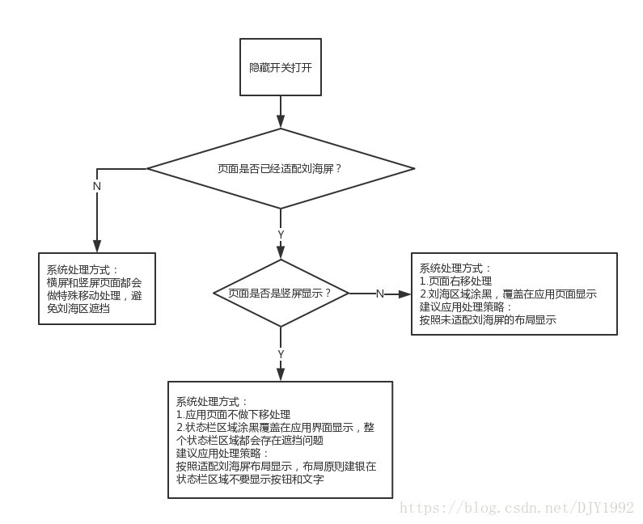

##### 华为刘海屏适配指南

**背景**

> 刘海屏指的是手机屏幕正上方由于追求极致边框而采用的一种手机解决方案。
>
> **因形似刘海儿而得名**。也有一些其他叫法：**挖孔屏、凹口屏**等

> 本文档统一按照刘海屏来命名。市场上已经有越来越多的手机都支持这种屏幕形式。

​		谷歌在安卓P版本中已经提供了统一的适配方案，可是在安卓O版本上如何适配呢？本文将详细介绍华为安卓O版本刘海屏适配方案。

​		使用华为提供的刘海屏SDK进行适配，此方案也会继承到华为安卓P版本手机上。在华为P版本手机中将同时支持两种方案：华为O版本方案+谷歌P版本方案。另外因为安卓O版本的刘海屏手机已经在市场上大量上市，这些手机在市场上会存续2~3年。所以建议大家现在要同时适配华为O版本方案以及谷歌P版本方案。


**华为已经发布的刘海屏手机信息**


##### 华为刘海屏手机安卓O版本适配方案

> 设计理念：尽量减少APP的开发工作量

处理逻辑：




4. ##### 华为刘海屏API接口

  > 4.1 判断是否刘海屏
  > 4.1.1 接口描述

是否是刘海屏手机：


true：是刘海屏 false：非刘海屏

4.1.2 调用范例

```
public static boolean hasNotchInScreen(Context context) {
    boolean ret = false;
    try {
        ClassLoader cl = context.getClassLoader();
        Class HwNotchSizeUtil = cl.loadClass("com.huawei.android.util.HwNotchSizeUtil");
        Method get = HwNotchSizeUtil.getMethod("hasNotchInScreen");
        ret = (boolean) get.invoke(HwNotchSizeUtil);
    } catch (ClassNotFoundException e) {
        Log.e("test", "hasNotchInScreen ClassNotFoundException");
    } catch (NoSuchMethodException e) {
        Log.e("test", "hasNotchInScreen NoSuchMethodException");
    } catch (Exception e) {
        Log.e("test", "hasNotchInScreen Exception");
    } finally {
        return ret;
    }
}
```

4.2 获取刘海尺寸
4.2.1 接口描述


4.2.2 调用范例

```
public static int[] getNotchSize(Context context) {
    int[] ret = new int[]{0, 0};
    try {
        ClassLoader cl = context.getClassLoader();
        Class HwNotchSizeUtil = cl.loadClass("com.huawei.android.util.HwNotchSizeUtil");
        Method get = HwNotchSizeUtil.getMethod("getNotchSize");
        ret = (int[]) get.invoke(HwNotchSizeUtil);
    } catch (ClassNotFoundException e) {
        Log.e("test", "getNotchSize ClassNotFoundException");
    } catch (NoSuchMethodException e) {
        Log.e("test", "getNotchSize NoSuchMethodException");
    } catch (Exception e) {
        Log.e("test", "getNotchSize Exception");
    } finally {
        return ret;
    }
}
```


 

##### 4.3 应用页面设置使用刘海区显示

**4.3.1 方案一**
使用新增的Meta-data属性android.notch_support，在应用的AndroidManifest.xml中增加meta-data属性，此属性不仅可以针对Application生效，也可以对Activity配置生效。

具体方式如下所示：

<meta-data android:name="android.notch_support" android:value="true"/>

对Application生效，意味着该应用的所有页面，系统都不会做竖屏场景的特殊下移或者是横屏场景的右移特殊处理：


    <application
        android:allowBackup="true"
        android:icon="@mipmap/ic_launcher"
        android:label="@string/app_name"
        android:roundIcon="@mipmap/ic_launcher_round"
        android:testOnly="false"
        android:supportsRtl="true"
        android:theme="@style/AppTheme">
        <meta-data android:name="android.notch_support" android:value="true"/>
    <activity android:name=".MainActivity">
        <intent-filter>
            <action android:name="android.intent.action.MAIN"/>
            <category android:name="android.intent.category.LAUNCHER"/>
        </intent-filter>
    </activity>

对Activity生效，意味着可以针对单个页面进行刘海屏适配，设置了该属性的Activity系统将不会做特殊处理：

```
<application
    android:allowBackup="true"
    android:icon="@mipmap/ic_launcher"
    android:label="@string/app_name"
    android:roundIcon="@mipmap/ic_launcher_round"
    android:testOnly="false"
    android:supportsRtl="true"
    android:theme="@style/AppTheme">
    <activity android:name=".MainActivity">
        <intent-filter>
            <action android:name="android.intent.action.MAIN"/>
            <category android:name="android.intent.category.LAUNCHER"/>
        </intent-filter>
    </activity>
    <activity android:name=".LandscapeFullScreenActivity" android:screenOrientation="sensor">
    </activity>
    <activity android:name=".FullScreenActivity">
        <meta-data android:name="android.notch_support" android:value="true"/>
    </activity>
```


4.3.2 方案二
使用给window添加新增的FLAG_NOTCH_SUPPORT

（1）接口1描述：应用通过增加华为自定义的刘海屏flag，请求使用刘海区显示


调用范例参考：

对Application生效，意味着该应用的所有页面，系统都不会做竖屏场景的特殊下移或者是横屏场景的右移特殊处理：

```
/*刘海屏全屏显示FLAG*/
public static final int FLAG_NOTCH_SUPPORT=0x00010000;
/**

- 设置应用窗口在华为刘海屏手机使用刘海区
- @param window 应用页面window对象
  */
  public static void setFullScreenWindowLayoutInDisplayCutout(Window window) {
  if (window == null) {
      return;
  }
  WindowManager.LayoutParams layoutParams = window.getAttributes();
  try {
      Class layoutParamsExCls = Class.forName("com.huawei.android.view.LayoutParamsEx");
      Constructor con=layoutParamsExCls.getConstructor(LayoutParams.class);
      Object layoutParamsExObj=con.newInstance(layoutParams);
      Method method=layoutParamsExCls.getMethod("addHwFlags", int.class);
      method.invoke(layoutParamsExObj, FLAG_NOTCH_SUPPORT);
  } catch (ClassNotFoundException | NoSuchMethodException | IllegalAccessException |InstantiationException 
  | InvocationTargetException e) {
      Log.e("test", "hw add notch screen flag api error");
  } catch (Exception e) {
      Log.e("test", "other Exception");
  }
  }
```


（2）接口2描述：可以通过clearHwFlags接口清除添加的华为刘海屏Flag，恢复应用不使用刘海区显示。


调用范例参考：

```
/*刘海屏全屏显示FLAG*/
public static final int FLAG_NOTCH_SUPPORT=0x00010000;
/**
 * 设置应用窗口在华为刘海屏手机使用刘海区
 * @param window 应用页面window对象
 */
public static void setNotFullScreenWindowLayoutInDisplayCutout (Window window) {
    if (window == null) {
        return;
    }
    WindowManager.LayoutParams layoutParams = window.getAttributes();
    try {
        Class layoutParamsExCls = Class.forName("com.huawei.android.view.LayoutParamsEx");
        Constructor con=layoutParamsExCls.getConstructor(LayoutParams.class);
        Object layoutParamsExObj=con.newInstance(layoutParams);
        Method method=layoutParamsExCls.getMethod("clearHwFlags", int.class);
        method.invoke(layoutParamsExObj, FLAG_NOTCH_SUPPORT);
    } catch (ClassNotFoundException | NoSuchMethodException | IllegalAccessException |InstantiationException 
    | InvocationTargetException e) {
        Log.e("test", "hw clear notch screen flag api error");
    } catch (Exception e) {
        Log.e("test", "other Exception");
    }
}
 
```

华为刘海屏flag动态添加和删除代码：

 ```
btn.setOnClickListener(new View.OnClickListener() {
    @Override
    public void onClick(View view) {
        if(isAdd) {//add flag
            isAdd = false;
            NotchSizeUtil.setFullScreenWindowLayoutInDisplayCutout(getWindow());           
            getWindowManager().updateViewLayout(getWindow().getDecorView(),getWindow().getDecorView().getLayoutParams());
        } else{//clear flag
            isAdd = true;
            NotchSizeUtil.setNotFullScreenWindowLayoutInDisplayCutout(getWindow());            
            getWindowManager().updateViewLayout(getWindow().getDecorView(),getWindow().getDecorView().getLayoutParams());
        }
    }
});
 
 ```

 

使用和不使用刘海区效果对比：




##### 4.4 获取默认和隐藏刘海区开关值接口

4.4.1 开关页面介绍
（1）老版本路径：系统设置→显示→显示区域控制



（2）新版本路径：系统设置→显示→屏幕顶部显示



4.4.2 隐藏开关打开之后，显示规格




4.4.3 读取开关状态调用范例

```
public static final String DISPLAY_NOTCH_STATUS = “display_notch_status”;
int mIsNotchSwitchOpen = Settings.Secure.getInt(getContentResolver(),DISPLAY_NOTCH_STATUS, 0);
 
```

// 0表示“默认”，1表示“隐藏显示区域”

5. #### 谷歌P版本刘海屏适配方案

  5.1 特性介绍
  谷歌称刘海屏为凹口屏以及屏幕缺口支持, 内容摘自：https://developer.android.com/preview/features#cutout
  推荐：《android 兼容所有刘海屏的方案大全》

5.2 接口介绍
（1）获取刘海尺寸相关接口：

https://developer.android.com/reference/android/view/DisplayCutout

所属类 方法 接口说明

1. android.view.DisplayCutout List getBoundingRects() 返回Rects的列表，每个Rects都是显示屏上非功能区域的边界矩形。设备的每个短边最多只有一个非功能区域，而长边上则没有

2. android.view.DisplayCutout int getSafeInsetBottom() 返回安全区域距离屏幕底部的距离，单位是px。

3. android.view.DisplayCutout int getSafeInsetLeft() 返回安全区域距离屏幕左边的距离，单位是px。
   android.view.DisplayCutout int getSafeInsetRight() 返回安全区域距离屏幕右边的距离，单位是px。

4. android.view.DisplayCutout int getSafeInsetTop() 返回安全区域距离屏幕顶部的距离，单位是px。

   

    

##### 5.3 参考实现代码

**（1）设置使用刘海区显示代码：**

```
getSupportActionBar().hide();
getWindow().getDecorView().setSystemUiVisibility(View.SYSTEM_UI_FLAG_FULLSCREEN | View.SYSTEM_UI_FLAG_LAYOUT_FULLSCREEN); 
//设置页面全屏显示
WindowManager.LayoutParams lp = getWindow().getAttributes();
lp.layoutInDisplayCutoutMode = 
       windowManager.LayoutParams.LAYOUT_IN_DISPLAY_CUTOUT_MODE_SHORT_EDGES; 
//设置页面延伸到刘海区显示
getWindow().setAttributes(lp);
注意：如果需要应用的布局延伸到刘海区显示，需要设置SYSTEM_UI_FLAG_LAYOUT_FULLSCREEN。
 
```

（1）获取刘海屏安全显示区域和刘海尺寸信息：

```
contentView = getWindow().getDecorView().findViewById(android.R.id.content).getRootView();
contentView.setOnApplyWindowInsetsListener(new View.OnApplyWindowInsetsListener() {
    @Override
    public WindowInsets onApplyWindowInsets(View view, WindowInsets windowInsets) {
        DisplayCutout cutout = windowInsets.getDisplayCutout();
        if (cutout == null) {
            Log.e(TAG, "cutout==null, is not notch screen");//通过cutout是否为null判断是否刘海屏手机
        } else {
            List<Rect> rects = cutout.getBoundingRects();
            if (rects == null || rects.size() == 0) {
                Log.e(TAG, "rects==null || rects.size()==0, is not notch screen");
            } else {
                Log.e(TAG, "rect size:" + rects.size());//注意：刘海的数量可以是多个
                for (Rect rect : rects) {
                    Log.e(TAG, "cutout.getSafeInsetTop():" + cutout.getSafeInsetTop()
                            + ", cutout.getSafeInsetBottom():" + cutout.getSafeInsetBottom()
                            + ", cutout.getSafeInsetLeft():" + cutout.getSafeInsetLeft()
                            + ", cutout.getSafeInsetRight():" + cutout.getSafeInsetRight()
                            + ", cutout.rects:" + rect
                    );
                }
            }
        }
        return windowInsets;
    }
});
 
```


（3）说明：

通过windowInsets.getDisplayCutout()是否为null判断是否刘海屏手机，如果为null为非刘海屏：

Line 6203: 05-24 11:16:46.766 11036 11036 E Cutout_test: cutout==null, is not notch screen
1
如果是刘海屏手机可以通过接口获取刘海信息：

Line 6211: 05-24 11:11:16.839 10733 10733 E Cutout_test: cutout.getSafeInsetTop():126, cutout.getSafeInsetBottom():0, 
cutout.getSafeInsetLeft():0, cutout.getSafeInsetRight():0, cutout.rects:Rect(414, 0 - 666, 126)
1
2
刘海个数可以是多个：

Line 6291: 05-24 11:27:04.517 11036 11036 E Cutout_test: rect size:2
Line 6292: 05-24 11:27:04.517 11036 11036 E Cutout_test: cutout.getSafeInsetTop():84, 
cutout.getSafeInsetBottom():84, cutout.getSafeInsetLeft():0, cutout.getSafeInsetRight():0, cutout.rects:Rect(351, 0 - 729, 84)
Line 6293: 05-24 11:27:04.517 11036 11036 E Cutout_test: cutout.getSafeInsetTop():84, 
cutout.getSafeInsetBottom():84, cutout.getSafeInsetLeft():0, cutout.getSafeInsetRight():0, cutout.rects:Rect(351, 1836 - 729, 1920)
1
2
3
4
5
6. UI适配
通过上面的2种方案（meta-data或者Flag），应用在华为刘海屏手机上就能默认使用刘海区显示了，为了避免UI被刘海区遮挡，应用还要进一步进行UI适配：

6.1 判断是否为刘海屏
判断是否为刘海屏？可以调用华为刘海屏API，参考4.1。

6.2 调整布局
如果是刘海屏，调整布局避开刘海区。

布局原则：保证重要的文字、图片、视频信息、可点击的控件和图标，应用弹窗等，建议显示在状态栏区域以下（安全区域）。如果内容不重要或者不会遮挡，布局可以延伸到状态栏区域（危险区域）。

建议按照如下布局原则修改：


获取系统状态栏高度接口：

public static int getStatusBarHeight(Context context) {
    int result = 0;
    int resourceId = context.getResources().getIdentifier("status_bar_height", "dimen", "android");
    if (resourceId > 0) {
        result = context.getResources().getDimensionPixelSize(resourceId);
    }
    return result;
}
1
2
3
4
5
6
7
8
建议窗口显示内容在状态栏区域以下的另外一个原因：华为有一个自研的隐藏刘海的需求，可以参考章节4.4。
————————————————
版权声明：本文为CSDN博主「奥特曼超人Dujinyang」的原创文章，遵循CC 4.0 BY-SA版权协议，转载请附上原文出处链接及本声明。
原文链接：https://blog.csdn.net/djy1992/article/details/80683575