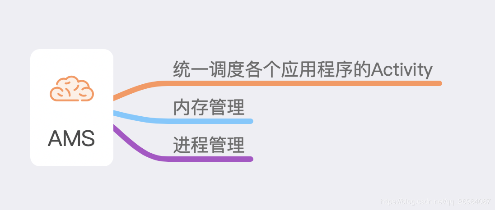
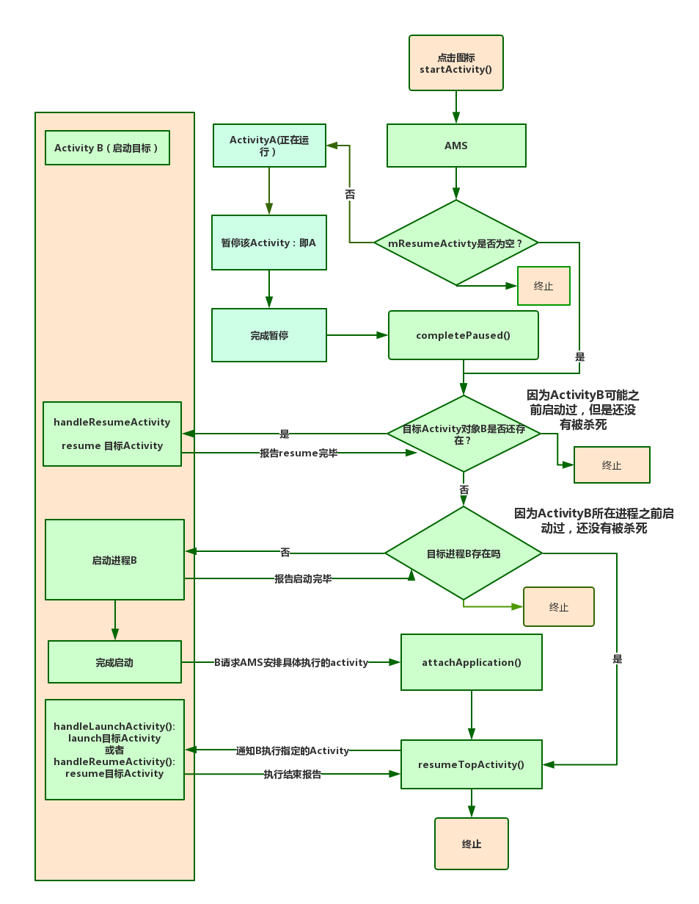
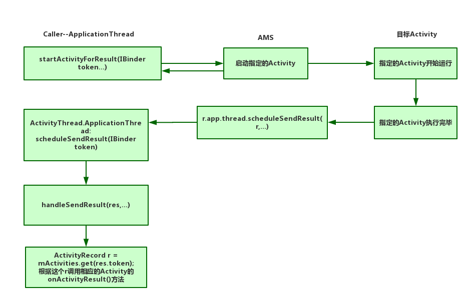

### AMS的功能

AMS的功能可以概述为以下三个：



​		首先来看看这个**统一调度各个应用程序之间的activity**，可以把AMS理解成一个管理员，管理着手机里面的	所有应用程序，每当一个应用程序想要启动activity，都要先报告AMS，AMS认为该应用程序可以启动，那么就通知该应用程序去执行启动activity操作，当应用程序启动完毕，也要报告AMS，AMS会记录对应的进程以及对应的activity，以便对activity进行管理和调控，例如内存不足时选择杀死某些优先级的activity。

既然应用程序启动activity需要AMS的调控，那么我们就来看看activity的启动过程以及过程中，AMS如何对应用程序加以调度，并且和应用程序之间进行交互的。

Activity的启动入口是startActivityForResult()，startActivity()其实也是调用了startActivityForResult(),那么就从这个入口去看看具体的启动流程吧;

### activity的启动流程

**activity的启动流程大概总结为：**

> 启动Activity B -> 当前有正在显示的activity吗 -> 有就先pause() -> B的进程存在吗 -> 不存在则创建 -> B进程启动指定的Activity

首先来看一下这个过程的具体流程图，其实就是上面流程简介的具体化：


现在从源码开始，一步一步的去看看具体的startActivity()的执行流程：

**一.首先是startActivity的调用流程**

从Activity中调用了startActivity()之后，经过一系列跳转，会执行到Instrument的execStartActivity(）方法中，这个Instrumentation是什么呢？可以说它是应用进程的管家，监控着应用进程与系统的所有交互，所有的创建、暂停、停止activity，都是通过它去发起的，它可以统计所有的开销。

那么再来看看execStartActivity()方法的内部实现：

```
 /** 
   * 1.先看看比较重要的参数的意义：
   * @param who:  当前的执行了startActivity的activity对象
   * @param contextThread :当前activity 的主线程，即是ApplicationThread对象
   * @param token：用于鉴定启动activity的对象
   * @param target：需要被启动的activity 对象
   **/    
 public ActivityResult execStartActivity(
            Context who, IBinder contextThread, IBinder token, Activity target,
            Intent intent, int requestCode, Bundle options) {

        IApplicationThread whoThread = (IApplicationThread) contextThread;
        ...
        
        //...省略关于ActivityMonitor测试工具类的部分
       
        try {
            intent.migrateExtraStreamToClipData();
            intent.prepareToLeaveProcess(who);
            
            /**
              * 2.看到这里，我们发现Instrumentation将启动activity的工作交给了AMS，这里就
              * 涉及到了IPC调用了，IPC调用是同步的，而startActivity()是在主线程中调用的
              * 那么这里会导致主线程阻塞吗？
              * 答案是不会的，由于AMS内部执行startActivity(）是异步的，所以会在很短时间内
              * 返回，然后最后再通过回调Activity的onActivityResult()，所以需要在这个方法
              * 中传入一个Token，即是Activity的标识
              **/
              
                int result = ActivityManager.getService()
                .startActivity(whoThread, who.getBasePackageName(), intent,
                        intent.resolveTypeIfNeeded(who.getContentResolver()),
                        token, target != null ? target.mEmbeddedID : null,
                        requestCode, 0, null, options);
            checkStartActivityResult(result, intent);
        } catch (RemoteException e) {
            throw new RuntimeException("Failure from system", e);
        }
        return null;
 
```

​		再来看下在AMS中是如何去实现这个startActivity的流程的,在AMS中经过一系列的调用，最终会调用如下startActivityAsUser()方法：

```
 /**
  * 1.来看一下重要参数的含义：
  * @param caller :指的是ApplicationThread，代表当前要启动activity的主线程
  * @param callingPackage:发起startActivity的进程包名
  * @param resultTo:Activity传来的token变量，对应的是AMS的ActivityRecord，AMS通过来识
  *                 别客户端进程的Activity
  *           
  **/

public final int startActivityAsUser(IApplicationThread caller, String callingPackage,
            Intent intent, String resolvedType, IBinder resultTo, String resultWho, int requestCode,
            int startFlags, ProfilerInfo profilerInfo, Bundle bOptions, int userId,
            boolean validateIncomingUser) {
        
		 //2.获取userId
        userId = mActivityStartController.checkTargetUser(userId, validateIncomingUser,
                Binder.getCallingPid(), Binder.getCallingUid(), "startActivityAsUser");

        /**
          * 3.这里将启动activity任务委托给了ActivityStartController,
          * ActivityStartController的主要工作就是将启动外部Activity的请求放入一个
          * 请求队列当中，使得这些请求可以被ActivityStarter处理，同时负责处理activity
          * 启动时的一些逻辑问题，例如处理待启动activity列表，记录home activity启动等，
          * 但是真正的启动逻辑还是由ActivityStarter来处理。
          **/
        return mActivityStartController.obtainStarter(intent, "startActivityAsUser")
                .setCaller(caller)
                .setCallingPackage(callingPackage)
                .setResolvedType(resolvedType)
                .setResultTo(resultTo)
                .setResultWho(resultWho)
                .setRequestCode(requestCode)
                .setStartFlags(startFlags)
                .setProfilerInfo(profilerInfo)
                .setActivityOptions(bOptions)
                .setMayWait(userId)
                .execute();    //4.然后再通过ActivityStarter执行startActivity的请求

    }
    
 
```

**二、运行条件检查以及intent的flag处理**

然后再去看看ActivityStarter里面执行startActivity的地方,ActivityStarter执行startActivity的代码非常长，各种条件、分支判断非常多，我们选择正常的流程来进行分析：

```
private int startActivity(....) {

 ProcessRecord callerApp = null;
    /**
      * 1.caller代表的是要启动Activity的进程的主线程，这里先去获取一个ProcessRecord,
      * 它是一个进程记录类，每个正在运行的进程都有一个ProcessRecord，
      * 在AMS中以<包名，ProcessRecord>的形式存储，这个ProcessRecord记录了进程的所有信息
      * 包括uid、userId、processName、curAdj(当前的OOM参数）等等
     **/ 
     if (caller != null) {
        callerApp = mService.getRecordForAppLocked(caller); 
             
        //2.从AMS中获取当前caller的ProcessRecord,其中ProcessRecord用到了LRU进行存储
            if (callerApp != null) {
                callingPid = callerApp.pid;
                callingUid = callerApp.info.uid;
            } else {
                Slog.w(TAG, "Unable to find app for caller " + caller
                        + " (pid=" + callingPid + ") when starting: "
                        + intent.toString());
                err = ActivityManager.START_PERMISSION_DENIED;
            }
        }

        final int userId = aInfo != null && aInfo.applicationInfo != null
                ? UserHandle.getUserId(aInfo.applicationInfo.uid) : 0;
               
        
        /**
          * 3.这里出现了一个ActivityStackSupervisor，顾名思义，就是activity栈的管理者,
          * 它有一个mActivityDisplays的变量用于存储ActivityDisplay，ActivityDisplay主要
          * 存储了ActivityStack，负责当前Display的栈的创建、添加、删除等等工作；
          * 
          * 遍历该ActivityStackSupervisor的mActivityDisplays，取得各个
          * ActivityDisplay,再遍历ActivityDisplay的ActivityStack，根据token去匹配,返回
          * 源Activity的ActivityRecord，ActivityRecord是一个Activity的记录类，
          * 记录了activity的两方面信息，一是环境信息，例如该activity隶属于哪个package，
          * 所在进程名称、文件路径、图标、主题等，二是运行状态信息，例如idle、stop、finishing等
          **/  
              
        ActivityRecord sourceRecord = null;
        ActivityRecord resultRecord = null;
        if (resultTo != null) {
            sourceRecord = mSupervisor.isInAnyStackLocked(resultTo);
            
            if (sourceRecord != null) {
                if (requestCode >= 0 && !sourceRecord.finishing) { 
                 //如果启动方式是startActivityForResult()且源activity还没有finishing
                    resultRecord = sourceRecord;
                }
            }
        }
        
        final int launchFlags = intent.getFlags();
        
		 /**
		   * 4.这里根据intent的信息去匹配component信息，这也是intent可以直接指定Activity名称
		   * 的原因，AMS会调用系统内部的PackageManager查询具体的Component名称，如果没有
		   * Component匹配该intent，则返回失败。
		   **/
		
        if ((launchFlags & Intent.FLAG_ACTIVITY_FORWARD_RESULT) != 0 && sourceRecord != null) {
        /**
          * 处理FLAG_ACTIVITY_FORWARD_RESULT：
		   * 比如：A 启动了 B，此时再从B启动C，并且B设置了FLAG_ACTIVITY_FORWARD_RESULT,那么C
		   * 运行时，可以在C中调用setResult(),然后finish，其结果会从C直接返回A,同时启动过程必须
		   * 如下：
		   * A(startActivityForResult)  -> B(startActivity)  -> C. 
		   * 同时B不能调用startActivityForResult,即requestCode 不能 >= 0,否则就会回调
		   * START_FORWARD_AND_REQUEST_CONFLICT冲突。
			**/	
            
            if (requestCode >= 0) {
                SafeActivityOptions.abort(options);
                return ActivityManager.START_FORWARD_AND_REQUEST_CONFLICT;
            }
            resultRecord = sourceRecord.resultTo;
            if (resultRecord != null && !resultRecord.isInStackLocked()) {
                resultRecord = null;
            }
            resultWho = sourceRecord.resultWho;
            requestCode = sourceRecord.requestCode;
            sourceRecord.resultTo = null;
            if (resultRecord != null) {
                resultRecord.removeResultsLocked(sourceRecord, resultWho, requestCode);
            }
            
            if (sourceRecord.launchedFromUid == callingUid) {
               /**
                 * 5.检查当前源activity是否和目标activity一致，即是
                 * A(startActivityForResult) -> B(startActivity)  ->B 的情况，将正在运
                 * 行的activity的包名赋值给目标activity。
                 **/
               callingPackage = sourceRecord.launchedFromPackage;
            }
        }

		 //intent 的component为空时或者activityInfo为空时，直接返回
        if (err == ActivityManager.START_SUCCESS && （intent.getComponent() == null ||（ aInfo == null））) {          
           ...
        }


		 /**
		   * 6.处理voiceSession的情况，当目前的activity有语音对话，要启动的activity也存在语音
		   * 对话，那么只有当目标activity指定了Intent.CATEGORY_VOICE才能启动。
		   **/
        if (err == ActivityManager.START_SUCCESS && sourceRecord != null
                && sourceRecord.getTask().voiceSession != null) {
            if ((launchFlags & FLAG_ACTIVITY_NEW_TASK) == 0
                    && sourceRecord.info.applicationInfo.uid != aInfo.applicationInfo.uid) {
                try {
                    intent.addCategory(Intent.CATEGORY_VOICE);
                    if (!mService.getPackageManager().activitySupportsIntent(
                            intent.getComponent(), intent, resolvedType)) {
                        Slog.w(TAG,
                                "Activity being started in current voice task does not support voice: "
                                        + intent);
                        err = ActivityManager.START_NOT_VOICE_COMPATIBLE;
                    }
                } catch (RemoteException e) {
                    Slog.w(TAG, "Failure checking voice capabilities", e);
                    err = ActivityManager.START_NOT_VOICE_COMPATIBLE;
                }
            }
        }
		 ...
		
        final ActivityStack resultStack = resultRecord == null ? null : resultRecord.getStack();

        ...
        
        
		 /**
		   * 7.对要启动的activity进行权限判断
		   **/
        boolean abort = !mSupervisor.checkStartAnyActivityPermission(intent, aInfo, resultWho,
                requestCode, callingPid, callingUid, callingPackage, ignoreTargetSecurity,
                inTask != null, callerApp, resultRecord, resultStack);   
        abort |= !mService.mIntentFirewall.checkStartActivity(intent, callingUid,
                callingPid, resolvedType, aInfo.applicationInfo);

        ...

		 /**
		   * 8.判断是否需要拦截该activity启动请求，例如该进程已经退出或者目标进程已经暂停了等等，
		   * 例如caller在调用startActivity()之后又被意外杀死的情况。
		   **/
        mInterceptor.setStates(userId, realCallingPid, realCallingUid, startFlags, callingPackage);
        if (mInterceptor.intercept(intent, rInfo, aInfo, resolvedType, inTask, callingPid,
                callingUid, checkedOptions)) {
            ...
        }
        
		/**
		  * 9.如果请求中断了，则通过ActivityRecord回调Activity的onActivityResult()方法，
		  * 流程结束
		  **/	
        if (abort) {
            if (resultRecord != null) {
                resultStack.sendActivityResultLocked(-1, resultRecord, resultWho, requestCode,
                        RESULT_CANCELED, null);
            }
            // We pretend to the caller that it was really started, but
            // they will just get a cancel result.
            ActivityOptions.abort(checkedOptions);
            return START_ABORTED;
        }
        
		//上面都是在对运行条件进行检查判断，遇到异常就终止流程，下面，继续执行正常流程
		
		 /**
		   * 10.创建一个临时的ActivityRecord对象，这个对象只是为了后面调用过程中的各种对比，
		   * 并非一定会加入到ActivityRecord列表中去。
		   **/	        
        ActivityRecord r = new ActivityRecord(mService, callerApp...);
        
        if (outActivity != null) {
            outActivity[0] = r;
        }

        if (r.appTimeTracker == null && sourceRecord != null) {
            // If the caller didn't specify an explicit time tracker, we want to continue
            // tracking under any it has.
            r.appTimeTracker = sourceRecord.appTimeTracker;
        }

        final ActivityStack stack = mSupervisor.mFocusedStack;
        
        
		 /**
		   * 11.检查是否允许切换activity，不允许切换的情况一般发生在当前已经暂停了正在执行的
		   * activity，正在等待下一个Activity启动时，此时不能进行Activity切换，但是会把指定的
		   * activity添加到mPendingActivityLaunches中，等待系统恢复后再继续执行。
		   **/
        if (voiceSession == null && (stack.getResumedActivity() == null
                || stack.getResumedActivity().info.applicationInfo.uid != realCallingUid)) {
            if (!mService.checkAppSwitchAllowedLocked(callingPid, callingUid,
                    realCallingPid, realCallingUid, "Activity start")) {
                mController.addPendingActivityLaunch(new PendingActivityLaunch(r,
                        sourceRecord, startFlags, stack, callerApp));
                ActivityOptions.abort(checkedOptions);
                return ActivityManager.START_SWITCHES_CANCELED;
            }
        }

        if (mService.mDidAppSwitch) {
            // This is the second allowed switch since we stopped switches,
            // so now just generally allow switches.  Use case: user presses
            // home (switches disabled, switch to home, mDidAppSwitch now true);
            // user taps a home icon (coming from home so allowed, we hit here
            // and now allow anyone to switch again).
            mService.mAppSwitchesAllowedTime = 0;
        } else {
            mService.mDidAppSwitch = true;
        }

		 /**
		   * 12.判断等待队列中是否有等待启动的Activity，如果有的话，应该先执行这里面等待的
		   * Activity。
		   **/
        mController.doPendingActivityLaunches(false);
       
        
    	 /**
    	   * 13.如果等待的队列为空，则下面的方法会调用startActivityUnchecked()方法，表明待启动
    	   * 的Activity已经经过了所有的检验，是一个“正当”的请求，可以进行启动了，启动activity有四
    	   * 种方法，standard、singleTop、 singTask、singleInstance，接下来，AMS会去判
    	   * 断要以哪种方式来启动指定的activity。
    	   **/
        return startActivity(....);
    }
 
```

**三、AMS根据启动intent去找到或者创建合适的Task**

接下来，AMS需要确定是否需要给目标activity创建一个新的Task或者是给它找到一个合适的task，具体的执行过程如下：

```
 private int startActivityUnchecked(...) {

   /**
     * 1.初始化状态,根据launchMode变量设置局部变量launchFlags,因为接下来要根据launchFlags来
     * 决定启动activity的方式，launchMode和launchFlags是不同的喔，mode是Activity在Android
     *  Manifest中声明的运行方式，而flags是调用者希望用哪一种形式去运行指定的Activity，是在调用
     *  startActivity()时参数intent中指定的。
     *  
     **/
       
      setInitialState(.....);
       
       
   	/**
   	  * 2.下面这里的工作就是计算flags以及是否需要创建task和目标activity，或者复用已有的activity，启动模式有四种，分别是standard、singleTop、singleTask、singleInstance
   	  * 这里会判断属于哪一种模式，然后分别进行处理：
   	  * standard：在当前栈中启动新的activity
   	  * singleTop：判断当前栈的栈顶是否是目标activity,是的话，则无需创建新的activity，而是调用它的onNewIntent()，否则就在栈顶创建一个新的目标activity
   	  * singeTask：判断指定的栈中是否存在目标activity，指定的栈由taskAffinity属性来指定，如果存在，则将该目标activity栈顶的其他activity都弹出栈，让该activity位于栈顶，且调用
   	  * 			 它的onNewIntent(），如果不存在，则在指定的栈中新建一个activity；
   	  * 			 一般情况下，同一个应用程序的activity都存在于同一个task中，但是当一个程序想调用其他的程序时，例如希望从当前程序调起发邮件的的activity，那么就需要指定目标activity
   	  * 			 为singleTask，且taskAffinity属性为邮件应用程序的包名，此时目标activity和邮件程序在同一个task中
   	  * singleInstance：判断目标activity 是否存在，不存在时则创建一个新的task，在该task中创建目标activity，一个手机中只有一个singleInstance的activity的实例，例如打电话的界面，一个
   	  * 			   手机中所有的应用程序都共享一个singleInstance的目标activity。
   	  * 			   	  
   	  * 
      computeLaunchingTaskFlags();
   	
      computeSourceStack();

       mIntent.setFlags(mLaunchFlags);
       
       ActivityRecord reusedActivity = getReusableIntentActivity();
   	 ....
   	 
       
       
   	 /**
   	   * 3.为目标activity赋予合法的权限,目标activity会在安装时指定所需要的权限，这里是将所需权限添加至缓存中
   	   **/	
       mService.grantUriPermissionFromIntentLocked(mCallingUid, mStartActivity.packageName,
               mIntent, mStartActivity.getUriPermissionsLocked(), mStartActivity.userId);
       mService.grantEphemeralAccessLocked(mStartActivity.userId, mIntent,
               mStartActivity.appInfo.uid, UserHandle.getAppId(mCallingUid));

       
       /**
         * 4.接下来，根据上面的判断结果，是执行哪种activity的启动方式，创建新的目标activity或者是直接resume已有的目标activity
         **/        
       if (newTask) {
           EventLog.writeEvent(EventLogTags.AM_CREATE_TASK, mStartActivity.userId,
                   mStartActivity.getTask().taskId);
       }
       ActivityStack.logStartActivity(
               EventLogTags.AM_CREATE_ACTIVITY, mStartActivity, mStartActivity.getTask());
       mTargetStack.mLastPausedActivity = null;

       mSupervisor.sendPowerHintForLaunchStartIfNeeded(false /* forceSend */, mStartActivity);

        /**
          * 5.这里是执行创建目标activity的操作，需要通知WMS将目标activity显示出来，并且添加activity的切换动画等
          * 
          **/
       mTargetStack.startActivityLocked(mStartActivity, topFocused, newTask, mKeepCurTransition,
               mOptions);
       //6.执行目标activity的resume操作        
       if (mDoResume) {
           final ActivityRecord topTaskActivity =
                   mStartActivity.getTask().topRunningActivityLocked();
           if (!mTargetStack.isFocusable()
                   || (topTaskActivity != null && topTaskActivity.mTaskOverlay
                   && mStartActivity != topTaskActivity)) {
               
               mTargetStack.ensureActivitiesVisibleLocked(null, 0, !PRESERVE_WINDOWS);
               
               mService.mWindowManager.executeAppTransition();
           } else {
               
               if (mTargetStack.isFocusable() && !mSupervisor.isFocusedStack(mTargetStack)) {
                   mTargetStack.moveToFront("startActivityUnchecked");
               }
               mSupervisor.resumeFocusedStackTopActivityLocked(mTargetStack, mStartActivity,
                       mOptions);
           }
       } else if (mStartActivity != null) {
           mSupervisor.mRecentTasks.add(mStartActivity.getTask());
       }
       mSupervisor.updateUserStackLocked(mStartActivity.userId, mTargetStack);

       mSupervisor.handleNonResizableTaskIfNeeded(mStartActivity.getTask(), preferredWindowingMode,
               preferredLaunchDisplayId, mTargetStack);

       return START_SUCCESS;
   }

 
```

**总结startActivityForResult()的执行过程**

